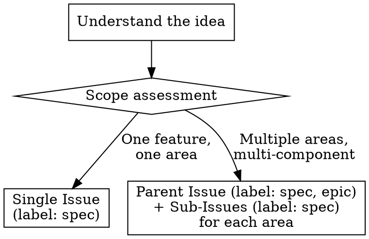
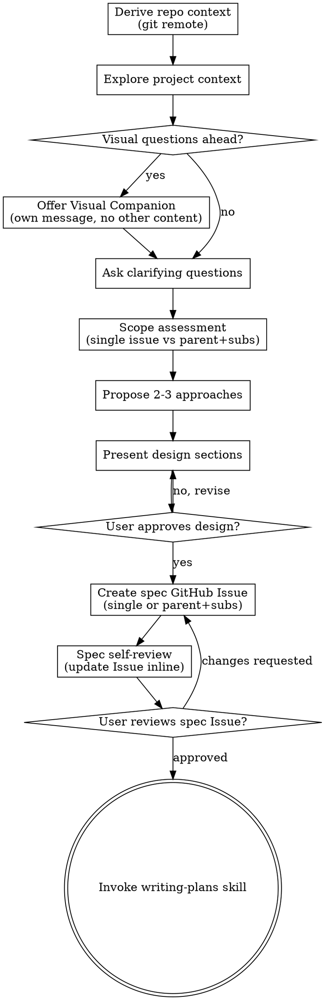

# Brainstorming Ideas Into Designs

Help turn ideas into fully formed designs and specs through natural collaborative dialogue, then capture the result as a GitHub Issue (small scope) or parent Issue with sub-issues (large scope).

Start by understanding the current project context, then ask questions one at a time to refine the idea. Once you understand what you're building, present the design and get user approval.

<HARD-GATE>
Do NOT invoke any implementation skill, write any code, scaffold any project, or take any implementation action until you have presented a design and the user has approved it. This applies to EVERY project regardless of perceived simplicity.
</HARD-GATE>

## Anti-Pattern: "This Is Too Simple To Need A Design"

Every project goes through this process. A todo list, a single-function utility, a config change — all of them. "Simple" projects are where unexamined assumptions cause the most wasted work. The design can be short (a few sentences for truly simple projects), but you MUST present it and get approval.

## Repository Context

Before starting the brainstorming process, derive the repository context from the working directory:

1. Run `git remote get-url origin` to identify `owner/repo`
2. If the command fails or there's no git repo, ask the user for the target repository
3. Store `owner` and `repo` for all subsequent GitHub operations

Use `owner` and `repo` in every GitHub MCP tool call throughout this skill.

## Scope Decision: Issue vs. Parent-with-Sub-Issues

After understanding the idea but before presenting the design, determine scope:

**Single Issue (small scope):** The specification is focused — one feature, one bugfix, one well-bounded improvement. The spec fits naturally in a single issue body.

**Parent Issue with sub-issues (large scope):** The specification touches multiple independent pieces of architecture or requires multiple moderately complex tasks. Each sub-issue should be a coherent, implementable unit.



**When in doubt, start with a single Issue.** It's easy to split later. Over-decomposing early creates coordination overhead.

## Checklist

You MUST create a task for each of these items and complete them in order:

1. **Derive repository context** — run `git remote get-url origin`, extract `owner/repo`
2. **Explore project context** — check existing issues, recent commits, relevant files
3. **Offer visual companion** (if topic will involve visual questions) — this is its own message, not combined with a clarifying question. See the Visual Companion section below.
4. **Ask clarifying questions** — one at a time, understand purpose/constraints/success criteria
5. **Propose 2-3 approaches** — with trade-offs and your recommendation
6. **Present design** — in sections scaled to their complexity, get user approval after each section
7. **Create the spec as a GitHub Issue** — write the validated design into an Issue body (see Issue Format below)
8. **Spec self-review** — quick inline check for placeholders, contradictions, ambiguity, scope (see below); update the Issue if needed
9. **User reviews spec Issue** — ask user to review the GitHub Issue before proceeding
10. **Transition to implementation** — invoke writing-plans skill to create the implementation plan

## Process Flow



**The terminal state is invoking writing-plans.** Do NOT invoke frontend-design, mcp-builder, or any other implementation skill. The ONLY skill you invoke after brainstorming is writing-plans.

## The Process

**Understanding the idea:**

- Check out the current project state first (existing issues, recent commits, relevant files)
- Before asking detailed questions, assess scope: if the request describes multiple independent subsystems, flag this immediately. Don't spend questions refining details of a project that needs to be decomposed first.
- If the project is too large for a single spec, plan the decomposition: what are the independent pieces, how do they relate, what order should they be built? Then brainstorm the first sub-project through the normal design flow. Each sub-project gets its own Issue → plan → implementation cycle.
- For appropriately-scoped projects, ask questions one at a time to refine the idea
- Prefer multiple choice questions when possible, but open-ended is fine too
- Only one question per message — if a topic needs more exploration, break it into multiple questions
- Focus on understanding: purpose, constraints, success criteria

**Exploring approaches:**

- Propose 2-3 different approaches with trade-offs
- Present options conversationally with your recommendation and reasoning
- Lead with your recommended option and explain why

**Presenting the design:**

- Once you believe you understand what you're building, present the design
- Scale each section to its complexity: a few sentences if straightforward, up to 200-300 words if nuanced
- Ask after each section whether it looks right so far
- Cover: architecture, components, data flow, error handling, testing
- Be ready to go back and clarify if something doesn't make sense

**Design for isolation and clarity:**

- Break the system into smaller units that each have one clear purpose, communicate through well-defined interfaces, and can be understood and tested independently
- For each unit, you should be able to answer: what does it do, how do you use it, and what does it depend on?
- Can someone understand what a unit does without reading its internals? Can you change the internals without breaking consumers? If not, the boundaries need work.
- Smaller, well-bounded units are also easier for you to work with — you reason better about code you can hold in context at once, and your edits are more reliable when files are focused. When a file grows large, that's often a signal that it's doing too much.

**Working in existing codebases:**

- Explore the current structure before proposing changes. Follow existing patterns.
- Where existing code has problems that affect the work (e.g., a file that's grown too large, unclear boundaries, tangled responsibilities), include targeted improvements as part of the design — the way a good developer improves code they're working in.
- Don't propose unrelated refactoring. Stay focused on what serves the current goal.

## Issue Format

### Single Issue (small scope)

Create one GitHub Issue using `issue_write` with `method: "create"`:

```
Title: [Descriptive name for the feature/change]
Labels: spec
Body:
  ## Goal
  [One sentence describing what this builds]

  ## Architecture
  [2-3 sentences about approach]

  ## Approach Chosen
  [Which of the 2-3 approaches and why]

  ## Requirements
  [Detailed requirements from the design discussion]

  ## Open Questions
  [Any unresolved questions — must be resolved before planning]
```

### Parent Issue with Sub-Issues (large scope)

1. Create the **parent issue** first using `issue_write` with `method: "create"`:

```
Title: [Epic-level name encompassing all sub-areas]
Labels: spec, epic
Body:
  ## Goal
  [One sentence describing the overall system]

  ## Architecture
  [How the sub-areas relate to each other]

  ## Sub-Issues
  [Will be populated with links after sub-issues are created]

  ## Open Questions
  [Any unresolved questions — must be resolved before planning]
```

2. Create each **sub-issue** using `issue_write` with `method: "create"`:

```
Title: [Specific area name]
Labels: spec
Body:
  ## Goal
  [One sentence for this area]

  ## Requirements
  [Detailed requirements for this area]

  ## Open Questions
  [Area-specific questions]
```

3. Link sub-issues to parent using `sub_issue_write` with `method: "add"`

4. Update the parent Issue body to include links to all sub-issues

### Label Usage

| Label | When | Meaning |
|-------|------|---------|
| `spec` | Always | This is a specification/design issue |
| `epic` | Parent issues only | This issue groups related sub-issues |
| `brainstorming` | During active brainstorming | Session is in progress |
| `plans` | After transitioning to writing-plans | Implementation planning underway |

Remove `brainstorming` label and add `plans` when transitioning to the writing-plans skill.

## After the Design

**Spec creation:**

- Create the GitHub Issue(s) using the MCP tools (`issue_write` for creation, `sub_issue_write` for nesting)
- Assign the `spec` label, plus `epic` if it's a parent issue
- Remove the `brainstorming` label and add `plans` label when transitioning to writing-plans

**Spec Self-Review:**
After creating the spec Issue(s), review them with fresh eyes:

1. **Placeholder scan:** Any "TBD", "TODO", incomplete sections, or vague requirements? Update the Issue to fix them.
2. **Internal consistency:** Do any sections contradict each other? Does the architecture match the feature descriptions?
3. **Scope check:** Is this focused enough for a single implementation plan, or does it need decomposition into sub-issues?
4. **Ambiguity check:** Could any requirement be interpreted two different ways? If so, pick one and make it explicit.

Fix any issues by updating the GitHub Issue. No need to re-review — just fix and move on.

**User Review Gate:**
After the spec review passes, ask the user to review the GitHub Issue before proceeding:

> "Spec created as Issue #N. Please review it and let me know if you want to make any changes before we start writing the implementation plan."

Wait for the user's response. If they request changes, update the Issue. Only proceed once the user approves.

**Implementation:**

- Invoke the writing-plans skill to create a detailed implementation plan
- Do NOT invoke any other skill. writing-plans is the next step.

## Key Principles

- **One question at a time** — Don't overwhelm with multiple questions
- **Multiple choice preferred** — Easier to answer than open-ended when possible
- **YAGNI ruthlessly** — Remove unnecessary features from all designs
- **Explore alternatives** — Always propose 2-3 approaches before settling
- **Incremental validation** — Present design, get approval before moving on
- **Be flexible** — Go back and clarify when something doesn't make sense
- **Specs are Issues** — The spec lives in GitHub, not in a local markdown file

## Visual Companion

A browser-based companion for showing mockups, diagrams, and visual options during brainstorming. Available as a tool — not a mode. Accepting the companion means it's available for questions that benefit from visual treatment; it does NOT mean every question goes through the browser.

**Offering the companion:** When you anticipate that upcoming questions will involve visual content (mockups, layouts, diagrams), offer it once for consent:
> "Some of what we're working on might be easier to explain if I can show it to you in a web browser. I can put together mockups, diagrams, comparisons, and other visuals as we go. This feature is still new and can be token-intensive. Want to try it? (Requires opening a local URL)"

**This offer MUST be its own message.** Do not combine it with clarifying questions, context summaries, or any other content. The message should contain ONLY the offer above and nothing else. Wait for the user's response before continuing. If they decline, proceed with text-only brainstorming.

**Per-question decision:** Even after the user accepts, decide FOR EACH QUESTION whether to use the browser or the terminal. The test: **would the user understand this better by seeing it than reading it?**

- **Use the browser** for content that IS visual — mockups, wireframes, layout comparisons, architecture diagrams, side-by-side visual designs
- **Use the terminal** for content that is text — requirements questions, conceptual choices, tradeoff lists, A/B/C/D text options, scope decisions

A question about a UI topic is not automatically a visual question. "What does personality mean in this context?" is a conceptual question — use the terminal. "Which wizard layout works better?" is a visual question — use the browser.

If they agree to the companion, read the detailed guide before proceeding:
`skills/brainstorming/visual-companion.md`

## Red Flags

| Thought | Reality |
|---------|---------|
| "This is too simple for a spec Issue" | Every change needs a spec. Small specs can be brief. |
| "I'll just create the Issue without clarifying questions" | Premature specs miss requirements. Always explore first. |
| "The spec can live as a local markdown file" | Issues are searchable, linkable, trackable. Local files aren't. |
| "Skip the self-review, it looked fine" | Self-review catches placeholders, contradictions, and ambiguity. |
| "Let me start implementing while the user reviews the spec" | HARD-GATE: no implementation before approval. |
